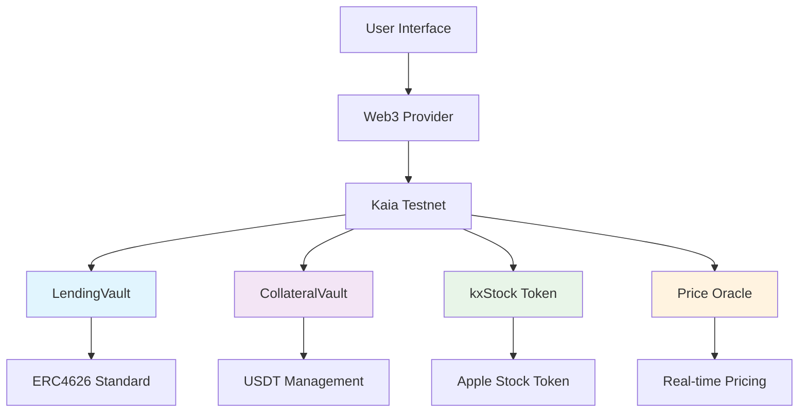
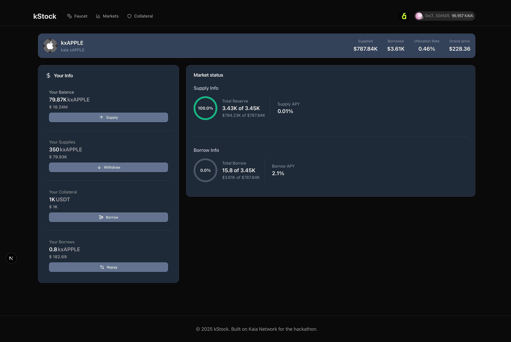
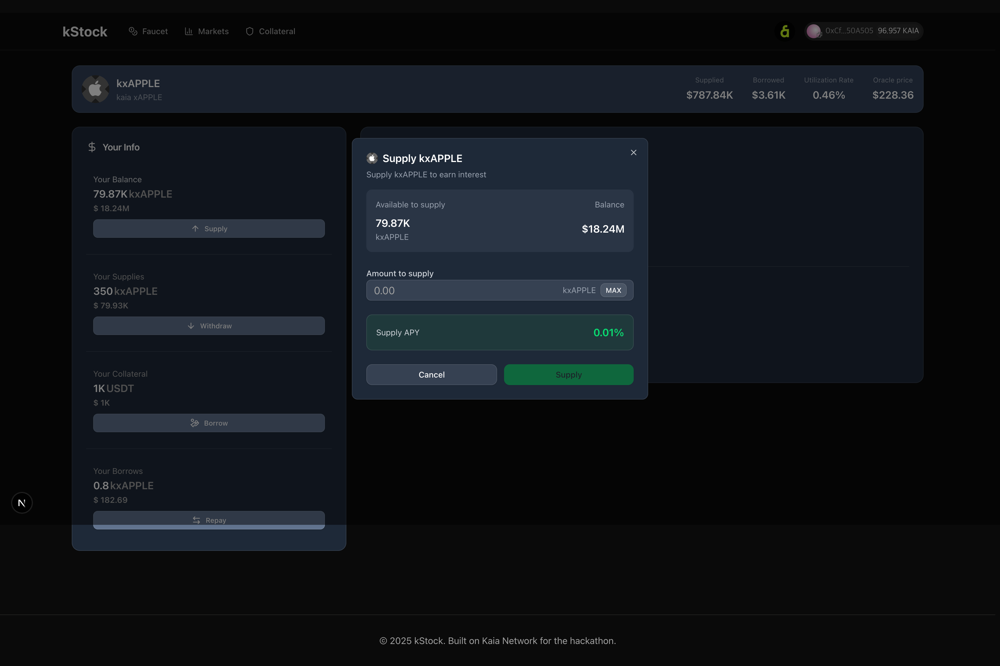
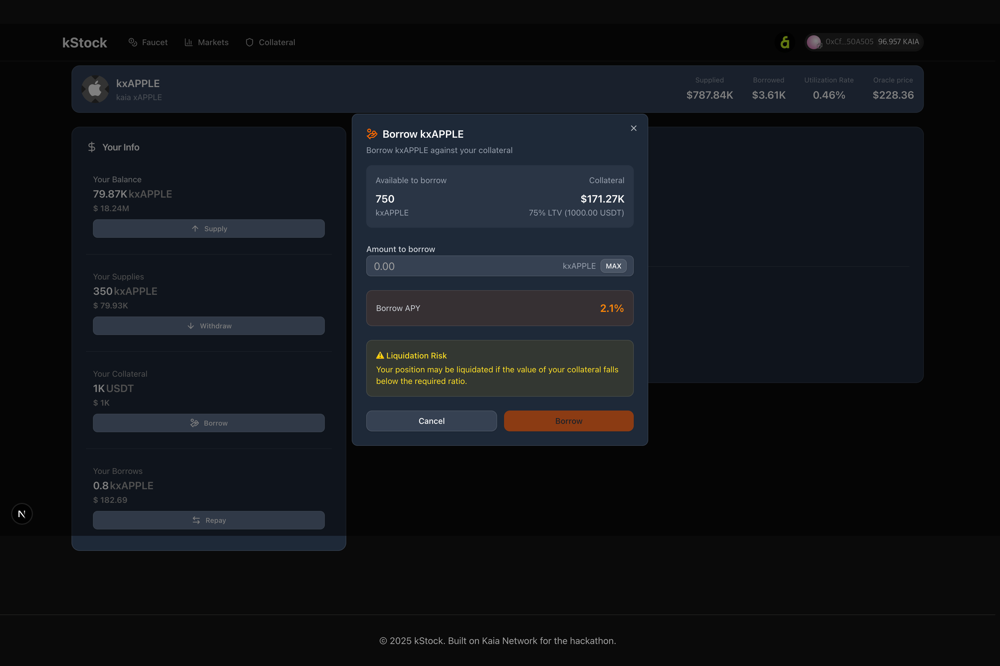
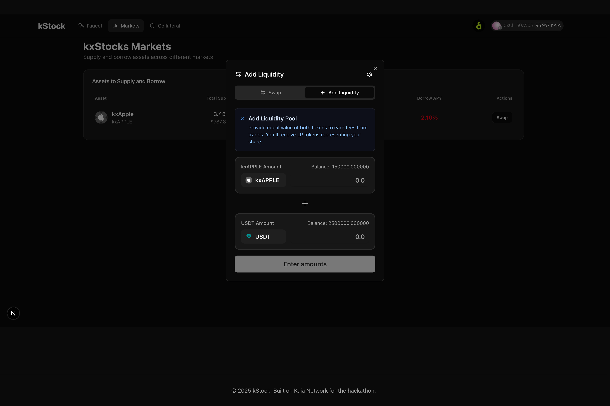
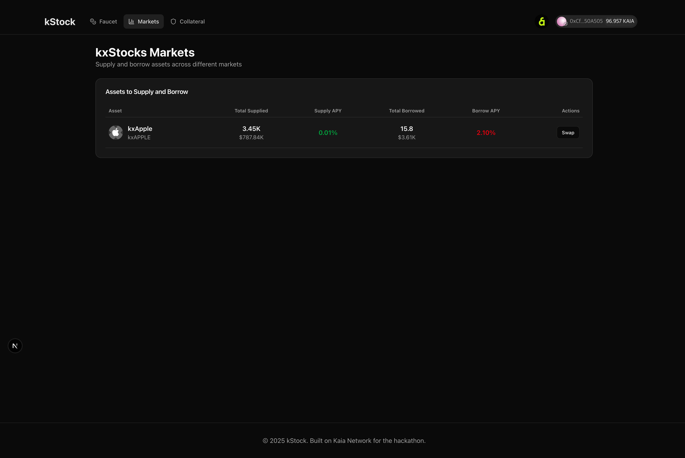

# 🏦 kStock - Kaia xStock Protocol

<div align="center">


**Revolutionizing DeFi with Tokenized Stocks on Kaia Blockchain**

_A next-generation lending protocol for tokenized stocks with unprecedented user experience_

[](https://nextjs.org/)
[](https://reactjs.org/)
[](https://www.typescriptlang.org/)
[](https://tailwindcss.com/)
[](https://kaia.io/)

[🚀 Live Demo](https://kaia-hackathon-xstock.vercel.app) • [🎯 Pitch Deck](https://drive.google.com/file/d/1iwgdGNB7Xt0wehWYepVSnUk-fcrzDA0a/view?usp=sharing)

</div>

---

## 🌟 Overview

**kStock** is an innovative DeFi protocol that bridges traditional finance and decentralized finance by enabling lending and borrowing against tokenized stocks. Built on the Kaia blockchain, our platform offers a seamless experience for users to interact with tokenized versions of real-world stocks while maintaining the security and transparency of blockchain technology.

### 🎯 Key Innovation

- **First-of-its-kind** tokenized stock lending protocol on Kaia
- **ERC4626-compliant** vault architecture for maximum compatibility
- **Real-time price feeds** through custom oracle implementation
- **Institutional-grade** risk management with dynamic interest rates

---

## ✨ Core Features

<div align="center">

|                        📊 **Markets Overview**                         |                          🚀 **kxStock Market**                           |                         🎁 **Free Tokens**                         |                  🛡️ **Collateral Supply**                  |
| :--------------------------------------------------------------------: | :----------------------------------------------------------------------: | :----------------------------------------------------------------: | :--------------------------------------------------------: |
| Real-time market data and analytics for all available tokenized stocks | Complete trading interface for supplying, borrowing, and trading kxAPPLE | Test environment with faucet functionality for seamless onboarding | USDT collateral management with optimized yield strategies |

</div>

### 🔥 What Makes Us Different

- **🌍 Universal Access**: No KYC required, global accessibility
- **⚡ Lightning Fast**: Built on Kaia's high-performance blockchain
- **🔒 Battle-tested**: ERC4626 standard ensures maximum security
- **📱 Mobile-first**: Responsive design optimized for all devices
- **🎨 Beautiful UX**: Modern interface with intuitive user flows

---

## 🚀 Quick Start

Get started with kStock in just 3 simple steps:

### 1️⃣ Connect & Get Tokens

```bash
# Connect your wallet to Kaia Testnet
# Visit our faucet to get free kxAPPLE tokens
🔗 Chain ID: 1001
💰 Get test tokens instantly
```

### 2️⃣ Supply or Deposit

```bash
# Option A: Provide liquidity to earn yield
💡 Supply kxAPPLE → Earn lending fees

# Option B: Deposit collateral to unlock borrowing
🛡️ Deposit USDT → Borrow against collateral
```

### 3️⃣ Earn & Grow

```bash
# Watch your assets grow
📈 Competitive yields up to 5.2% APY
🔄 Flexible borrowing with dynamic rates
📊 Real-time portfolio tracking
```

---

## 🏗️ Technical Architecture

### Smart Contract Infrastructure



### 🛠️ Core Contracts

| Contract              | Purpose               | Standard | Address                                      |
| --------------------- | --------------------- | -------- | -------------------------------------------- |
| **LendingVault**      | Core lending protocol | ERC4626  | `0x5738216073AE89876bBC693BcC401962ad597EA4` |
| **CollateralVault**   | Collateral management | ERC4626  | `0x23dd4A8DE699635046CBb94D64B5eBA7df5f9A36` |
| **kxStock (Apple)**   | Tokenized Apple stock | ERC20    | `0xa2f6E1a6F430C1Ab0E26f942a96a4F2718aeB2fB` |
| **SimplePriceOracle** | Price feed provider   | Custom   | `0xba3D82B1AdD1C3e9CDa45c978B7b967c4d7671BD` |
| **MockUSDT**          | Test collateral token | ERC20    | `0x30087C901942284a90361039ffbbDE949949C45E` |

---

## 💻 Development Setup

### Prerequisites

- Node.js 18+
- npm/yarn/pnpm
- Git
- Foundry (for smart contracts)

### 🚀 Frontend Setup

```bash
# Clone the repository
git clone https://github.com/your-username/kaia-hackathon.git
cd kaia-hackathon

# Install dependencies
npm install

# Start development server
npm run dev

# Open http://localhost:3000
```

### ⛓️ Smart Contract Development

```bash
# Navigate to contract directory
cd contract

# Install Foundry dependencies
forge install

# Compile contracts
forge build

# Run tests
forge test

# Deploy to Kaia Testnet
forge script script/1.Deploy.s.sol --rpc-url https://archive-rpc.testnet.kaia.io --broadcast
```

### 🔧 Environment Variables

```bash
# Create .env.local file
NEXT_PUBLIC_WALLETCONNECT_PROJECT_ID=your_project_id
NEXT_PUBLIC_KAIA_RPC_URL=https://archive-rpc.testnet.kaia.io
```

---

## 📊 Technical Specifications

### Blockchain Details

- **Network**: Kaia Testnet
- **Chain ID**: 1001
- **RPC**: `https://archive-rpc.testnet.kaia.io`
- **Explorer**: [KaiaScope](https://baobab.klaytnscope.com)

### Protocol Parameters

```typescript
const PROTOCOL_CONFIG = {
  LTV_RATIO: "80%", // Loan-to-Value ratio
  LIQUIDATION_THRESHOLD: "85%", // Liquidation trigger
  LIQUIDATION_BONUS: "5%", // Liquidator incentive
  BASE_RATE: "2%", // Base interest rate
  OPTIMAL_UTILIZATION: "80%", // Target utilization
};
```

### Tech Stack

- **Frontend**: Next.js 15, React 19, TypeScript
- **Styling**: Tailwind CSS 4, Radix UI, Shadcn/ui
- **Web3**: Wagmi, Viem, Reown AppKit
- **Smart Contracts**: Solidity, Foundry, OpenZeppelin
- **State Management**: TanStack Query, React Hook Form

---

## 🎯 Hackathon Highlights

### 🏆 Innovation Points

1. **First tokenized stock lending on Kaia** - Pioneering new use cases
2. **ERC4626 vault architecture** - Industry standard implementation
3. **Dynamic interest rate model** - Optimized capital efficiency
4. **Beautiful, accessible UI** - Professional-grade user experience
5. **Complete test environment** - Ready for immediate evaluation

### 🚀 Business Impact

- **Market Size**: $1.2T DeFi lending market opportunity
- **User Base**: Targeting retail and institutional investors
- **Revenue Model**: Platform fees from lending/borrowing activities
- **Scalability**: Multi-asset support planned (TSLA, NVDA, etc.)

### 🔬 Technical Excellence

- **Gas Optimized**: Efficient contract design
- **Security First**: Multiple safety mechanisms
- **Standards Compliant**: ERC4626 compatibility
- **Extensible**: Modular architecture for future features

---

## 📸 Screenshots

### Market Interface


_lending and borrowing against tokenized versions of real-world assets_

### Supply xStocks in Kaia


_supply xStocks into Lending Pool get decentralized yield permissionlessly_

### Borrow xStocks in Kaia


_borrow xStocks against stable collateral. experiencing holding tokenized versions of real-world assets against Stable Assets_

### Provide xStocks as Liquidity in Kaia


_make more yield by providing xStocks_

### More Markets are coming!


_Keep eye on kStock as additional tokenized stocks are coming (TSLA, NVDA, GOOGL)_

---

## 🛣️ Roadmap

### Phase 1: Foundation ✅

- [x] Core smart contracts
- [x] Basic web interface
- [x] Kaia testnet deployment

### Phase 2: Enhancement 🚧

- [ ] Additional tokenized stocks (TSLA, NVDA, GOOGL)
- [ ] Brdige USDT from Kaia to Solana
- [ ] Trade Solana xStock with CEX-like experience
- [ ] Trade Solana xStock as ETFs
- [ ] Advanced analytics dashboard
- [ ] Mobile app development

### Phase 3: Mainnet 🎯

- [ ] Security audits
- [ ] Mainnet deployment
- [ ] Institutional partnerships

---

## 👥 Team

<div align="center">

|  |  |  |  |
| :--------------------------------------------------: | :--------------------------------------------------: | :--------------------------------------------------: | :--------------------------------------------------: |
|                       **Keni**                       |                      **Chris**                       |                      **Pengun**                      |                      **g0ddog**                      |
|                    Web3 Strategy                     |                Web3 Community expert                 |              Smart Contract & Security               |                  FrontEnd Develper                   |
|                                                      |                                                      |                                                      |                                                      |

</div>

---

## 🤝 Contributing

We welcome contributions! Please see our [Contributing Guidelines](CONTRIBUTING.md) for details.

### Development Workflow

```bash
# Fork the repository
# Create a feature branch
git checkout -b feature/amazing-feature

# Make changes and commit
git commit -m 'Add amazing feature'

# Push to branch
git push origin feature/amazing-feature

# Open a Pull Request
```

---

## 📄 License

This project is licensed under the MIT License - see the [LICENSE](LICENSE) file for details.

---

## 🌐 Links & Resources

- 🌍 **Website**: [kaia-hackathon-xstock.vercel.app](https://kaia-hackathon-xstock.vercel.app)
- 📚 **Pitch Deck**: [Pitch Deck](https://drive.google.com/file/d/1iwgdGNB7Xt0wehWYepVSnUk-fcrzDA0a/view?usp=sharing)
- 🐦 **Telegram**: [kaiaxStock](https://t.me/kaiastock)

---

<div align="center">

**Built with ❤️ for the Kaia Hackathon**

_Democratizing access to tokenized stock markets through DeFi innovation_

[](https://kaia.io/)

</div>
